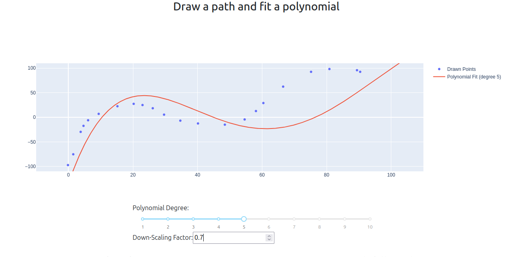

# dash_interactive_polynomial_fitter

A Dash app for interactive curve drawing and polynomial fitting.

## Installation (Debian Linux)

1. **Install Python and pip** (if not already installed):
    ```bash
    sudo apt update
    sudo apt install python3 python3-pip
    ```

2. **Clone the repository**:
    ```bash
    git clone git@github.com:brammmieee/dash_interactive_polynomial_fitter.git
    cd dash_interactive_polynomial_fitter
    ```

3. **Create and activate a virtual environment**:
    ```bash
    python3 -m venv venv
    source venv/bin/activate
    ```

4. **Install the required packages**:
    ```bash
    pip install -r requirements.txt
    ```

## Running the App

Start the app with:
```bash
python app.py
```
## Screenshot

The screenshot below displays the dashboard with the interactive polynomial fitting tool. The tool for drawing the polynomial is annotated in the image. All zooming and drawing tools are fully functional.


